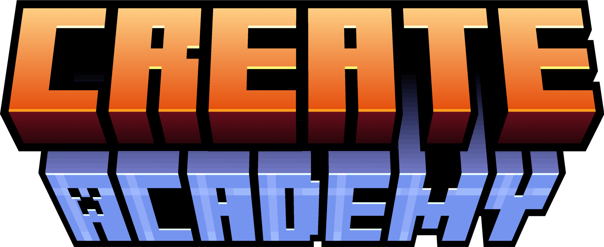

<p align="center"></p>

<h1 align="center">Launcher</h1>

<em><h5 align="center">(formerly Electron Launcher and a fork of Helios Launcher)</h5></em>

<p align="center">Join Create Academy 3 without worrying about installing Java, Forge, or other mods. We'll handle that for you.</p>


## Description

Create Academy is a Minecraft server built upon the Create mod. With over 500 unique players connecting last season, Create Academy offers the ultimate vanilla Create mod experience enhanced with a plethora of custom content, including a custom economy, custom resource packs, custom recipes, and more. Team up with your friends, communicate seamlessly via the integrated voice chat, automate resource gathering, and engage in trade with other teams...

Download and install the launcher to gauge all it can do!

#### Need Help? [Contact the developers]

[](https://discord.com/users/431469113341116426)

#### Like the project? Leave a ⭐ star on the repository!

## Downloads

You can download from [GitHub Releases](https://github.com/Fairy-Jeux/CreateAcademyLauncher/releases)
**Supported Platforms**

If you download from the [Releases](https://github.com/Fairy-Jeux/CreateAcademyLauncher/releases) tab, select the installer for your system.

| Platform | File |
| -------- | ---- |
| Windows x64 | `Helios-Launcher-setup-VERSION.exe` |
| macOS x64 | `Helios-Launcher-setup-VERSION-x64.dmg` |
| macOS arm64 | `Helios-Launcher-setup-VERSION-arm64.dmg` |
| Linux x64 | `Helios-Launcher-setup-VERSION.AppImage` |

## Development

This section details the setup of a basic developmentment environment.

### Getting Started

**System Requirements**

* [Node.js][nodejs] v20

---

**Clone and Install Dependencies**

```console
> git clone https://github.com/dscalzi/HeliosLauncher.git
> cd HeliosLauncher
> npm install
```

---

**Launch Application**

```console
> npm start
```

---

**Build Installers**

To build for your current platform.

```console
> npm run dist
```

Build for a specific platform.

| Platform    | Command              |
| ----------- | -------------------- |
| Windows x64 | `npm run dist:win`   |
| macOS       | `npm run dist:mac`   |
| Linux x64   | `npm run dist:linux` |

Builds for macOS may not work on Windows/Linux and vice-versa.

---

### Visual Studio Code

All development of the launcher should be done using [Visual Studio Code][vscode].

Paste the following into `.vscode/launch.json`

```JSON
{
  "version": "0.2.0",
  "configurations": [
    {
      "name": "Debug Main Process",
      "type": "node",
      "request": "launch",
      "cwd": "${workspaceFolder}",
      "program": "${workspaceFolder}/node_modules/electron/cli.js",
      "args" : ["."],
      "outputCapture": "std"
    },
    {
      "name": "Debug Renderer Process",
      "type": "chrome",
      "request": "launch",
      "runtimeExecutable": "${workspaceFolder}/node_modules/.bin/electron",
      "windows": {
        "runtimeExecutable": "${workspaceFolder}/node_modules/.bin/electron.cmd"
      },
      "runtimeArgs": [
        "${workspaceFolder}/.",
        "--remote-debugging-port=9222"
      ],
      "webRoot": "${workspaceFolder}"
    }
  ]
}
```

This adds two debug configurations.

#### Debug Main Process

This allows you to debug Electron's [main process][mainprocess]. You can debug scripts in the [renderer process][rendererprocess] by opening the DevTools Window.

#### Debug Renderer Process

This allows you to debug Electron's [renderer process][rendererprocess]. This requires you to install the [Debugger for Chrome][chromedebugger] extension.

Note that you **cannot** open the DevTools window while using this debug configuration. Chromium only allows one debugger, opening another will crash the program.

---

## Resources

* [Helios Launcher](https://github.com/dscalzi/HeliosLauncher)

The best way to contact the developers is on [Discord](https://discord.com/users/431469113341116426).

---


[nodejs]: https://nodejs.org/en/ 'Node.js'
[vscode]: https://code.visualstudio.com/ 'Visual Studio Code'
[mainprocess]: https://electronjs.org/docs/tutorial/application-architecture#main-and-renderer-processes 'Main Process'
[rendererprocess]: https://electronjs.org/docs/tutorial/application-architecture#main-and-renderer-processes 'Renderer Process'
[chromedebugger]: https://marketplace.visualstudio.com/items?itemName=msjsdiag.debugger-for-chrome 'Debugger for Chrome'
[discord]: https://discord.gg/zNWUXdt 'Discord'
[issues]: https://github.com/dscalzi/HeliosLauncher/wiki 'issues'
[nebula]: https://github.com/dscalzi/Nebula 'dscalzi/Nebula'
[v2branch]: https://github.com/dscalzi/HeliosLauncher/tree/ts-refactor 'v2 branch'

### Special Thanks

* [@dscalzi](https://github.com/dscalzi) and his [project](https://github.com/dscalzi/HeliosLauncher) for the original launcher.

* [@Ax3dGaming](https://github.com/Ax3dGaming): for help me and create the jsonCreator.
